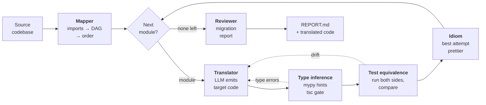

<div align="center">


# CodeShift

**Translate a codebase into another language, and prove the behavior survived.**

A multi-agent migration system that translates module by module and then runs the
original and the translation on identical inputs to catch what the compiler cannot.
v1 targets Python → TypeScript; the architecture is language-agnostic behind
pluggable adapters.

<sub>
Python 3.12 · LangGraph · Ollama · tree-sitter · networkx · Hypothesis · Streamlit · 190 tests passing
</sub>

</div>

---

## How it works

Six agents on a LangGraph state machine. The outer loop walks modules in
dependency order; the inner loop is translate ↔ verify, and it is where the
project actually lives or dies.



Dotted edges are retries. A third one is not drawn: output that is empty or exports
nothing is rejected before it reaches the oracles, because an empty module type-checks
perfectly and would sail through. All retry paths share **one budget per file**, so a
module cannot spend its attempts twice.

**1 · Map** — parse every module, resolve imports down to the internal ones, and
topologically sort the dependency graph. Translating in that order means a module's
dependencies are already translated when its turn comes, and their signatures go into
the prompt as context.

**2 · Translate** — one module at a time. On a retry the prompt carries the *previous
attempt, line-numbered*, framed as "revise this, do not start over" — without it the
model regenerates from the same source and reproduces the same bug, which is exactly
what happened for the first several weeks of this project.

**3 · Type-check** — mypy reads the source for hints, `tsc` grades the output. Code that
does not compile goes straight back to the translator, skipping the differential run,
because executing code that cannot build tells you nothing.

**4 · Differential test — the part that matters.** Four stages, because "it compiled"
is not evidence of anything:

| Stage | What it does | Why |
|---|---|---|
| **Generate inputs** | Values per parameter type, plus constructor arguments when the callable is a method | A method needs a receiver. Each call gets a *fresh* one, so a diverging call cannot poison every call after it and misattribute the blame. |
| **Run both sides** | Original and translation in subprocesses on identical inputs, isolated in Docker when it is available | The only way to catch semantics the type system cannot see — `strip()` vs `trim()` disagreeing on `\x1c`, `split()` vs a regex disagreeing on Unicode whitespace. Both were real findings. |
| **Compare** | Return value, exception type, *and the object's attributes after the call* | Without the last one, a mutating method that returns nothing compares `None` against `undefined` and passes having tested nothing. |
| **Name what was skipped** | `async def`, properties, constructors that cannot be built from generated arguments — each recorded by name | An untested module must not be indistinguishable from a clean one. "Verified equivalent" always means code ran and matched. |

**5 · Idiom** — every fully-evaluated attempt is scored on `(type errors, distinct failure
modes)`, and the *best* one is restored here rather than whichever came last. The loop is
not monotonic: fixing a type error lets a module reach the differential run for the first
time, which surfaces drift, and fixing that drift can reintroduce the type error. Prettier
is the formatting backstop.

**6 · Report** — a Markdown migration report: per-module verdict, attempts, what was
checked, what was not, and the isolation the run actually had.

## Stack

Everything is **free / open-source — no API key, no cost.**

Python 3.12 · LangGraph (orchestration) · **local Ollama** LLM (default
`qwen3:14b`; set `qwen2.5:7b` in `codeshift/config.py` for faster, lower-quality runs)
· tree-sitter + `ast` (parsing) · networkx (dependency DAG) · Hypothesis + pytest
(differential testing; TypeScript executed live via `tsx`) · Docker (execution
sandbox, optional — see below) · mypy + `tsc` (type oracles) · Prettier (idiom
backstop).

The LLM is isolated in `codeshift/llm/client.py`, so swapping the backend is a
one-file change.

## Sandboxing

The test-equivalence agent **executes** the translated code, which a language
model wrote. `sandbox` in `codeshift/config.py` decides what that execution gets:

| Setting | Behaviour |
|---|---|
| `"docker"` | Requires isolation. Both sides run in a throwaway container — no network, read-only mounts, non-root, memory/CPU/PID capped. **If Docker is unavailable, nothing is executed** and the affected modules are reported as unverified rather than run unprotected. Use this for code you did not write. |
| `"auto"` (default) | Isolates when Docker is present; otherwise runs on the host and says so, in the log and in the report. |
| `"host"` | Deliberate, unisolated execution. Fast, and fine for a fixture you wrote yourself. |

The sandbox images build themselves on first use (`codeshift/sandbox/images/`)
and are tagged by a hash of their Dockerfile, so editing one rebuilds it. The
build needs the network; the runs never have it.

A run's isolation is stated at the top of `REPORT.md` — "verified equivalent"
means something different depending on where the code ran.

## Status

**The architecture is complete; the tool is not yet validated at scale.** All six
agents work, the pipeline runs end to end at zero cost on a local model, and
"verified equivalent" means code was executed and compared. But every result so
far comes from two small fixtures totalling 7 modules — see
[Limitations](#limitations) before pointing this at a real codebase.

## Prerequisites

- A Python 3.12 environment (the author's is a conda env named `starGPU`;
  nothing depends on the name).
- **[Ollama](https://ollama.com)** running locally, with a model pulled:
  ```bash
  ollama pull qwen3:14b
  ```
- **Node.js** (for the TypeScript target: `npx tsx` runs it, `npx prettier` formats it).
  Not needed for running translated code under `sandbox="docker"` — the image
  carries its own — but still needed for the `tsc` and Prettier passes.
- **Docker** — optional, and the difference between isolated and unisolated
  execution. See [Sandboxing](#sandboxing).

## Setup

```bash
PY="python"                     # or the full path to your env's interpreter
"$PY" -m pip install -r requirements.txt
```

For type checking, copy `pyrightconfig.example.json` to `pyrightconfig.json` and
point `venvPath`/`venv` at your environment — Pyright cannot resolve the
installed packages without them, which is why the real file is gitignored.

No API key or `.env` is needed. To point at a remote Ollama server, set the
`OLLAMA_HOST` environment variable (or `ollama_host` in `codeshift/config.py`).

## Usage

```bash
"$PY" main.py --source ./tests/fixtures/sample_app --from python --to typescript
```

Translated code is written to `data/output/`, and the migration report to
`data/output/REPORT.md` (also printed to the console).

### Dashboard

```bash
"$PY" -m streamlit run ui/app.py
```

Launches runs from the browser and streams them live: each module's verification
verdict, the translate↔verify loop's attempt-by-attempt error counts (`1 → 0 → 1`,
labelled improving/stuck/regressed), the report, and source-vs-translated code
side by side. The graph runs on a worker thread and publishes a state snapshot
after every node, so the page stays responsive through a 20-minute run.

## Layout

```
codeshift/
  graph.py, state.py, config.py   # orchestration core
  candidates.py                   # best-attempt scoring across retries
  verification.py                 # verified vs. never-checked (one shared rule)
  llm/                            # the ONLY LLM boundary (local Ollama)
    prompts/pitfalls/<a>-<b>.md   # per-pair semantic trip-wires (optional)
  agents/                         # one module per agent = one graph node
  adapters/                       # per-language plug-ins (python/, typescript/)
  sandbox/                        # container isolation (policy.py decides, loudly)
  depgraph/                       # dependency graph, cycle handling, order
  equivalence/  report/  utils/
ui/                               # Streamlit dashboard (app.py, runner.py)
tools/                            # dev scripts (make_logo.py)
images/                           # logo (PNG + SVG)
tests/fixtures/                   # sample_app, class_app, cyclic_app
```

## Tests

```bash
"$PY" -m pytest tests -q        # 190 tests
"$PY" -m mypy codeshift
"$PY" -m pyright
```

## Limitations

Stated plainly, because a migration tool that oversells its own verification is
worse than no tool. Everything below is known and unfixed.

**Only ever run on small fixtures.** The two test projects total 7 modules, each
with roughly one function or class. Every "verified equivalent" result in this
repo comes from those. Nothing is known about 50+ modules, which is where
context limits and compounding errors become the real problem.

**Circular imports are handled, but they cost context.** Cycles are condensed
into strongly-connected components, so the sort always succeeds; each cycle is
then broken at its least-dependent member and named in the report. That module
is still translated before its own dependencies exist, so it gets less context
than every other module — a degradation, not a failure.

**The Docker sandbox has never actually run a container.** Docker is not
installed on the development machine, so the container path is covered by unit
tests asserting the argv, mounts and flags — not by execution. `sandbox="docker"`
is the documented way to run untrusted code safely; treat that claim as
untested until someone runs it on a machine with Docker.

**Comparison gaps that can produce wrong reports**, rather than crashes:

- Floats are compared exactly (`equivalence/diff.py`), so numeric code would
  report drift on ordinary rounding differences.
- Values with no JSON encoding are normalized to a shared form — sets and JS
  `Set`s to a tagged sorted array, JS `Map`s to plain objects, dates to epoch
  milliseconds — but **a naive Python `datetime` is read as UTC**, because it
  carries no zone while a JS `Date` is always an instant. Code where that
  assumption is wrong will compare wrongly. Types outside that list (`Decimal`,
  `bytes`, custom `__eq__`) still fall back to `str()` and can differ on
  formatting alone.
- Parse errors are swallowed (`adapters/python/parser.py`) instead of being
  surfaced in the run's error list.
- Hypothesis cannot shrink (`equivalence/inputs.py`), so a single bug arrives as
  dozens of near-identical failures rather than one minimal repro. The
  translator dedupes them for its retry prompt, which treats the symptom.
- Constructors inherited from a base class are refused rather than resolved,
  so those classes are reported unverified instead of being tested.

**Results are not reproducible.** The LLM is nondeterministic. The best observed
runs are 4/4 modules on `sample_app` and 3/3 on `class_app`, every module on the
first attempt — but a clean run is not guaranteed to repeat.
